# Nepali Hybrid Search Engine Prototype

[](https://www.python.org/)
[](https://www.elastic.co/)
[](https://flask.palletsprojects.com/)
[](https://docs.docker.com/compose/)
[](https://huggingface.co/intfloat/multilingual-e5-large)
[](LICENSE)

Hybrid search over Nepali (Devanagari) Wikipedia text. The stack fuses BM25 lexical matching with dense kNN vector search in Elasticsearch 8, runs queries through a Devanagari NLP pipeline, and serves a Flask dashboard (Gunicorn in Docker).

---

## Table of contents

- [What this project does](#what-this-project-does)
- [Architecture](#architecture)
- [Docker setup (recommended)](#docker-setup-recommended)
- [Using the web UI](#using-the-web-ui)
- [Local Python setup (optional)](#local-python-setup-optional)
- [HTTP API](#http-api)
- [Core Python API (`search_engine.py`)](#core-python-api-search_enginepy)
- [Project layout](#project-layout)
- [Configuration](#configuration)
- [Troubleshooting](#troubleshooting)
- [License](#license)

---

## What this project does

- Hybrid retrieval: BM25 on stemmed `content` plus cosine kNN on 1024-dim embeddings, with sidebar sliders for `bm25_boost` and `vector_boost`.
- Devanagari preprocessing: NFKC normalization, zero-width joiner removal, HTML and non-Devanagari stripping, `nepalikit` stopwords, `nepali_stemmer` suffix stripping.
- Embeddings: Hugging Face `intfloat/multilingual-e5-large` with `passage:` / `query:` prefixes.
- Indexing: streams from local `dataset.csv` into index `nepai_ir_corpus`. **Note:** The dataset will be shared to the general public after the paper is published.
- Web app: Flask + static HTML/CSS/JS with four tabs (search, compare modes, diagnostics, NLP sandbox), Elasticsearch status, and re-index controls.
- CLI: `python main.py` checks Elasticsearch, indexes 1,000 documents if the index is empty, then runs a sample hybrid query.

---

## Architecture

```mermaid
flowchart TD
    subgraph Data Ingestion Pipeline
        A[dataset.csv] -->|Stream Records| B[Raw Devanagari Text]
        B --> C[Devanagari NLP Preprocessing]
        C -->|Cleaned Passage| D[multilingual-e5-large Encoder]
        D -->|1024-dim Vector| E[Elasticsearch 8+ Index]
        C -->|Stemmed Text Tokens| E
    end

    subgraph Query Execution Pipeline
        Q[User Search Query] --> R[Devanagari NLP Preprocessing]
        R -->|Stemmed Query Tokens| S1[Lexical BM25 Search]
        R -->|Formatted Query String| S2[multilingual-e5-large Encoder]
        S2 -->|Query Embedding| S3[kNN Vector Search]
        S1 & S3 --> T[Elasticsearch Hybrid Scoring]
        T --> U[Ranked Results + Telemetry]
    end
```



### 1. Devanagari NLP (`preprocess_nepali_text` in `search_engine.py`)

1. Unicode NFKC plus removal of U+200D / U+200C.
2. HTML tags stripped; characters outside U+0900–U+097F and whitespace removed.
3. Stopwords dropped via `nepalikit`.
4. Remaining tokens stemmed with `NepStemmer` (for example `नेपालको` becomes `नेपाल`).

### 2. Embeddings

- Model: `intfloat/multilingual-e5-large` (1024 dimensions).
- Indexing prefix: `passage: <cleaned_text>`
- Query prefix: `query: <effective_query>`

### 3. Elasticsearch mapping (`nepai_ir_corpus`)

```json
{
  "mappings": {
    "properties": {
      "title": { "type": "text", "analyzer": "whitespace" },
      "content": { "type": "text", "analyzer": "whitespace" },
      "raw_text": { "type": "text", "index": false },
      "embedding": {
        "type": "dense_vector",
        "dims": 1024,
        "index": true,
        "similarity": "cosine"
      }
    }
  }
}
```

### 4. Search modes

- **Lexical**: BM25 `match` on `content`.
- **Vector**: kNN on `embedding` (cosine).
- **Hybrid**: both in one Elasticsearch request, with `bm25_boost` and `vector_boost`.

---

## Docker setup (recommended)

This is the path to use on another machine. Compose starts Elasticsearch 8.11.1 (single node, security off) and the Flask app. The web container talks to Elasticsearch at `http://elasticsearch:9200`.

### What you need

- Docker Desktop (Windows or macOS) or Docker Engine + Compose plugin (Linux). Compose v2 (`docker compose`) is expected.
- At least about 8 GB RAM free. Elasticsearch heap is 512 MB; the first start also downloads `intfloat/multilingual-e5-large` (~2.2 GB) into the web image/container.
- Git.
- Ports **5000** (UI) and **9200** (Elasticsearch) unused on the host.

On Windows, enable WSL 2 backend in Docker Desktop if you are asked to.

### Step 1: Install Docker

1. Install [Docker Desktop](https://docs.docker.com/get-docker/) (or Docker Engine + Compose on Linux).
2. Start Docker and wait until it is running (`docker info` should succeed).
3. Confirm Compose:

```bash
docker compose version
```

### Step 2: Clone the repository

```bash
git clone https://github.com/sujalbajra/Nepali-Search-Engine-Prototype.git
cd Nepali-Search-Engine-Prototype
```

If you already have the project as `ILPRL`, `cd` into that directory instead.

### Step 3: Build and start

From the project root (the folder that contains `docker-compose.yml`):

```bash
docker compose up --build
```

First build installs Python packages from `requirements.txt` and can take several minutes. After that:

1. Elasticsearch starts and the healthcheck curls `http://localhost:9200` inside that container (10s interval, 5 retries).
2. The `web` service waits until Elasticsearch is healthy, then Gunicorn binds `0.0.0.0:5000`.

Leave this terminal open, or run in the background:

```bash
docker compose up --build -d
docker compose logs -f web
```

### Step 4: Confirm the stack is up

```bash
docker compose ps
```

Both `es_hybrid_search` and `web_hybrid_search` should be running. Elasticsearch should report healthy.

From the host:

```bash
curl http://localhost:9200
curl http://localhost:5000
```

The first command returns Elasticsearch cluster JSON. The second returns the HTML for the search UI.

### Step 5: Open the app and index data

1. In a browser, open [http://localhost:5000](http://localhost:5000).
2. Sidebar **System Status** should show ES connected. Indexed documents will be `0` until you index.
3. First search or first re-index loads the embedding model inside the web container. That can take a few minutes with no results yet; watch `docker compose logs -f web`.
4. Under **Dataset Indexing**, set sample size (default 1000, range 100–5000) and click **Re-index Dataset**. This loads documents from the local `dataset.csv` file, embeds it, and bulk-indexes into Elasticsearch. Wait until the UI reports success.
5. Run a query on the Search tab (presets such as `नेपालको इतिहास र संस्कृति` work).

Re-index **deletes and recreates** the index, so existing documents are replaced.

### Step 6: Stop and start later

```bash
# Stop containers (keeps the Elasticsearch volume `esdata`)
docker compose down

# Start again without a full rebuild
docker compose up -d
```

To wipe indexed data as well:

```bash
docker compose down -v
```

### Docker notes

| Item | Detail |
| :--- | :--- |
| Web image | `python:3.10-slim`, `gunicorn --bind 0.0.0.0:5000 --timeout 120 flask_app:app` |
| `ES_URL` in the web container | `http://elasticsearch:9200` (hostname of the Compose service) |
| Host UI | `http://localhost:5000` |
| Host Elasticsearch | `http://localhost:9200` (security disabled; local prototype only) |
| Persistent data | named volume `esdata` |
| Heap | `ES_JAVA_OPTS=-Xms512m -Xmx512m` |

If the first search times out, raise Gunicorn timeout in `Dockerfile` or wait until the model has finished loading, then retry.

---

## Using the web UI

Sidebar: Elasticsearch connection, document count, top-k (1–20), BM25 / vector boosts, sample size, re-index.

| Tab | What it does |
| :--- | :--- |
| Search | Devanagari query, mode (hybrid / lexical / vector), ranked hits, latency (NLP, encode, ES). |
| Compare modes | Same query through hybrid, BM25, and vector; side-by-side ranks and latency. |
| Diagnostics | Cluster info and index stats (polled about every 10 seconds). |
| NLP sandbox | Shows NFKC, symbol strip, stopword removal, and stemming for pasted text. |

---

## Local Python setup (optional)

Use this if you want to run Flask or the CLI on the host. Elasticsearch can still come from Compose (`docker compose up elasticsearch` only) or a local 8.x install.

### Prerequisites

- Python 3.10+
- Git
- Elasticsearch 8.x at `http://localhost:9200` (or set `ES_URL`)

### 1. Clone and virtualenv

```bash
git clone https://github.com/sujalbajra/Nepali-Search-Engine-Prototype.git
cd Nepali-Search-Engine-Prototype

python -m venv venv
```

Windows PowerShell:

```powershell
.\venv\Scripts\Activate.ps1
```

Linux / macOS:

```bash
source venv/bin/activate
```

Conda:

```bash
conda create -n ilprl python=3.10 -y
conda activate ilprl
```

### 2. Install Python packages

```bash
pip install -r requirements.txt
```

### 3. Start Elasticsearch

Compose (from the project root):

```bash
docker compose up elasticsearch
```

Or a one-off container:

```bash
docker run -d \
  --name elasticsearch \
  -p 9200:9200 \
  -p 9300:9300 \
  -e "discovery.type=single-node" \
  -e "xpack.security.enabled=false" \
  docker.elastic.co/elasticsearch/elasticsearch:8.11.1
```

Or install [Elasticsearch 8.x](https://www.elastic.co/downloads/elasticsearch), set `xpack.security.enabled: false` in `config/elasticsearch.yml`, then:

- Windows: `.\bin\elasticsearch.bat`
- Linux/macOS: `./bin/elasticsearch`

Check: `curl http://localhost:9200`

### 4. Run the app

Flask (debug server, port 5000):

```bash
python flask_app.py
```

Or Gunicorn (Linux/macOS):

```bash
gunicorn --bind 0.0.0.0:5000 --timeout 120 flask_app:app
```

Open [http://localhost:5000](http://localhost:5000). Point `ES_URL` at your cluster if it is not on localhost:

```bash
# Linux / macOS
export ES_URL=http://localhost:9200

# Windows PowerShell
$env:ES_URL="http://localhost:9200"
```

CLI smoke test (indexes 1,000 docs if the index is empty, then searches `नेपालको इतिहास र संस्कृति`):

```bash
python main.py
```

The CLI always uses `http://localhost:9200`. If only the Compose web service is up, that hostname is `elasticsearch` inside Docker, so run the CLI on the host while Elasticsearch is published on port 9200.

---

## HTTP API

Served by `flask_app.py`. JSON request/response unless noted.

| Method | Path | Body / query | Response |
| :--- | :--- | :--- | :--- |
| GET | `/` | — | Search UI HTML |
| POST | `/api/search` | `{ "query", "mode", "top_k", "bm25_boost", "vector_boost" }` | `{ "results", "cleaned_query", "latency" }` |
| POST | `/api/compare` | `{ "query", "top_k", "bm25_boost", "vector_boost" }` | `{ "hybrid", "lexical", "vector" }` each with `results` and `latency` |
| GET | `/api/diagnostics` | — | `{ "es_connected", "index_name", "cluster_info", "index_stats" }` |
| POST | `/api/reindex` | `{ "sample_size" }` (default 500 in the API, 1000 in the UI) | `{ "success", "indexed_count" }` |
| POST | `/api/nlp_sandbox` | `{ "text" }` | `{ "steps": { raw, nfkc, symbols_stripped, ... } }` |

`mode` is `hybrid` (default), `lexical`, or `vector`. Empty queries return 400. Unreachable Elasticsearch returns 503.

Example:

```bash
curl -X POST http://localhost:5000/api/search \
  -H "Content-Type: application/json" \
  -d "{\"query\":\"नेपालको इतिहास र संस्कृति\",\"mode\":\"hybrid\",\"top_k\":5}"
```

---

## Core Python API (`search_engine.py`)

| Function | Parameters | Description |
| :--- | :--- | :--- |
| `preprocess_nepali_text()` | `text: str, return_steps: bool = False` | NFKC, ZWJ removal, Devanagari filter, stopwords, stemming. With `return_steps=True`, returns a dict of stages. |
| `get_es_client()` | `es_url: str = "http://localhost:9200"` | Elasticsearch client with timeout and retries. |
| `check_es_connection()` | `es: Elasticsearch` | `True` if ping succeeds. |
| `load_encoder()` | `model_name: str` | Loads SentenceTransformer (default `intfloat/multilingual-e5-large`). |
| `build_index()` | `es, index_name, dims=1024` | Deletes existing index if present, then creates mapping. |
| `index_dataset()` | `es, encoder, index_name, sample_size=1000, batch_size=32, progress_callback` | Streams from `dataset.csv`, embeds, bulk indexes. Returns `(count, index_name)`. |
| `get_index_stats()` | `es, index_name` | `{ exists, count, status }`. |
| `perform_search()` | `es, encoder, index_name, query_text, top_k, mode, bm25_boost, vector_boost` | Returns `(results, cleaned_query, latency)`. |

---

## Project layout

```
Nepali-Search-Engine-Prototype/
├── flask_app.py          # Flask routes and JSON APIs
├── search_engine.py      # NLP, embeddings, Elasticsearch
├── main.py               # CLI: connect, index if empty, sample search
├── requirements.txt
├── Dockerfile            # Python 3.10 image + Gunicorn on port 5000
├── docker-compose.yml    # elasticsearch + web
├── templates/index.html  # Dashboard markup
├── static/css/style.css
├── static/js/main.js     # Tabs, search, compare, diagnostics, sandbox
└── README.md
```

---

## Configuration

| Variable | Default | Used by |
| :--- | :--- | :--- |
| `ES_URL` | `http://localhost:9200` (Compose web: `http://elasticsearch:9200`) | `flask_app.py`, Dockerfile / Compose |
| `INDEX_NAME` | `nepai_ir_corpus` | `flask_app.py` |
| `FLASK_APP` | `flask_app.py` | Dockerfile |
| `PYTHONUNBUFFERED` | `1` | Dockerfile |

`main.py` does not read these env vars; it hardcodes localhost and the default index name.

---

## Troubleshooting

**Elasticsearch unreachable**  
Wait for the healthcheck (`docker compose ps`). Confirm port 9200 is free. On the host use `http://localhost:9200`; inside the web container use `http://elasticsearch:9200`.

**Web container starts before ES is ready**  
Compose already uses `depends_on` with `condition: service_healthy`. If you still see 503s, check `docker compose logs elasticsearch`.

**First request is slow or Gunicorn times out**  
The embedding model downloads and loads on first encode. Watch `docker compose logs -f web`. Retry after the model is loaded. Indexing large samples also needs a stable network to Hugging Face.

**Out of memory**  
Give Docker more RAM. Elasticsearch is capped at 512 MB heap; the encoder needs several GB on top.

**Windows Unicode errors in the CLI**  
`search_engine.py` forces UTF-8 for text `open()`. In PowerShell you can also set:

```powershell
$env:PYTHONUTF8=1
```

**Rebuild after code changes**

```bash
docker compose up --build
```

---

## License

Distributed under the MIT License. See `LICENSE` for more information.
