# 🇳🇵 Nepali Hybrid Search Engine Prototype

[](https://www.python.org/)
[](https://www.elastic.co/)
[](https://huggingface.co/intfloat/multilingual-e5-large)
[](https://streamlit.io/)
[](LICENSE)

A high-performance **Hybrid Search Engine** built for low-resource Devanagari script (**Nepali**). The system combines **Lexical BM25 Search** and **Dense Vector Semantic Search (kNN)** over Elasticsearch 8+, integrated with a custom Devanagari NLP preprocessing pipeline and an interactive Streamlit diagnostic app.

---

## 📌 Table of Contents

- [Features](#-features)
- [Architecture & Process Workflow](#-architecture--process-workflow)
  - [1. Devanagari NLP Preprocessing Pipeline](#1-devanagari-nlp-preprocessing-pipeline)
  - [2. Multilingual Dense Vector Embedding](#2-multilingual-dense-vector-embedding)
  - [3. Indexing Architecture & Schema](#3-indexing-architecture--schema)
  - [4. Multi-Modal Search Execution](#4-multi-modal-search-execution)
- [Local Setup & Installation](#-local-setup--installation)
  - [Prerequisites](#prerequisites)
  - [Step 1: Clone the Repository](#step-1-clone-the-repository)
  - [Step 2: Virtual Environment Setup](#step-2-virtual-environment-setup)
  - [Step 3: Install Dependencies](#step-3-install-dependencies)
  - [Step 4: Start Elasticsearch Server](#step-4-start-elasticsearch-server)
- [Running the Application](#-running-the-application)
  - [Option A: Interactive Web UI (Streamlit)](#option-a-interactive-web-ui-streamlit)
  - [Option B: Command Line Interface (CLI)](#option-b-command-line-interface-cli)
- [Project Directory Structure](#-project-directory-structure)
- [API Reference](#-api-reference)
- [Troubleshooting](#-troubleshooting)

---

## ✨ Features

- **⚡ Hybrid Search Engine**: Fuses BM25 term matching with dense kNN vector retrieval using tunable boost parameters (`bm25_boost`, `vector_boost`).
- **🇳🇵 Custom Devanagari NLP Pipeline**:
  - **Unicode Normalization**: NFKC normalization and Zero-Width Joiner (`\u200d`, `\u200c`) removal.
  - **Symbol & Noise Stripping**: Filters non-Devanagari characters (`\u0900-\u097F`) and HTML tags.
  - **Stopword Filtering**: Strips common Nepali stop words via `nepalikit`.
  - **Morphological Stemming**: Strips grammatical suffixes using `nepali_stemmer`.
- **🧠 Multilingual Semantic Embeddings**: Powered by HuggingFace `intfloat/multilingual-e5-large` generating 1024-dimensional dense vectors.
- **📦 Dataset Ingestion**: Streams documents directly from HuggingFace Wikimedia Wikipedia (`wikimedia/wikipedia` - Nepali `20231101.ne`).
- **🖥️ Web Dashboard (Streamlit)**:
  - **Single Query Search**: Full telemetry breakdown (NLP Prep, Encoding, Elasticsearch latency).
  - **Multi-Mode Comparative Benchmark**: Side-by-side comparison of Hybrid vs. Lexical vs. Vector search with top-K overlap analysis.
  - **Index Health & Diagnostics**: Cluster status and manual re-indexing controls.
  - **Devanagari NLP Sandbox**: Visualizes intermediate preprocessing stages step-by-step.
- **💻 Windows UTF-8 Ready**: Built-in global I/O patches to handle Devanagari text cleanly on Windows environments.

---

## 🏗️ Architecture & Process Workflow

The following flowchart details how raw query text and document datasets flow through the system:

```mermaid
flowchart TD
    subgraph Data Ingestion Pipeline
        A[HuggingFace Wikipedia Dataset] -->|Stream Records| B[Raw Devanagari Text]
        B --> C[Devanagari NLP Preprocessing]
        C -->|Cleaned Passage| D[multilingual-e5-large Encoder]
        D -->|1024-dim Vector| E[Elasticsearch 8+ Index]
        C -->|Stemmed Text Tokens| E
    end

    subgraph Query Execution Pipeline
        Q[User Search Query] --> R[Devanagari NLP Preprocessing]
        R -->|Stemmed Query Tokens| S1[Lexical BM25 Search]
        R -->|Formatted Query String| S2[multilingual-e5-large Encoder]
        S2 -->|Query Embedding| S3[kNN Vector Search]
        S1 & S3 --> T[Elasticsearch Hybrid Scoring & Fusion]
        T --> U[Ranked Results + Telemetry]
    end
```



### 1. Devanagari NLP Preprocessing Pipeline
Text preprocessing takes place in `preprocess_nepali_text()` in `search_engine.py`:
1. **Unicode NFKC Normalization**: Converts lookalike Devanagari characters into canonical representation and strips zero-width joiners/non-joiners.
2. **Noise & HTML Removal**: Regex `[^\u0900-\u097F\s]` strips punctuation, numbers, non-Devanagari scripts, and HTML markup.
3. **Stopword Stripping**: Removes non-informative words (e.g., `र`, `मा`, `छ`, `हुन्`) loaded from `nepalikit`.
4. **Morphological Stemming**: Passes tokens through `NepStemmer` to strip inflectional suffixes (e.g., `नेपालको` $\rightarrow$ `नेपाल`).

### 2. Multilingual Dense Vector Embedding
- Model: `intfloat/multilingual-e5-large` (1024 dimensions).
- **Prefixing strategy**:
  - Passage indexing prefix: `passage: <cleaned_text>`
  - Search query prefix: `query: <effective_query>`

### 3. Indexing Architecture & Schema
The Elasticsearch index (`nepali_wikipedia_prototype`) uses the following mapping:
```json
{
  "mappings": {
    "properties": {
      "title": { "type": "text", "analyzer": "whitespace" },
      "content": { "type": "text", "analyzer": "whitespace" },
      "raw_text": { "type": "text", "index": false },
      "embedding": {
        "type": "dense_vector",
        "dims": 1024,
        "index": true,
        "similarity": "cosine"
      }
    }
  }
}
```

### 4. Multi-Modal Search Execution
- **Lexical BM25 Mode**: Performs standard match query on `content` with term weights.
- **Dense Vector Mode**: Executes cosine similarity kNN vector search against `embedding`.
- **Hybrid Mode**: Combines BM25 lexical score and kNN vector similarity score inside Elasticsearch with customizable boost multipliers.

---

## ⚙️ Local Setup & Installation

### Prerequisites
Before starting, ensure you have the following installed on your machine:
- **Python 3.9** or higher (Recommended: Anaconda or Python `venv`)
- **Elasticsearch 8.x** running locally on `http://localhost:9200`
- **Git**

---

### Step 1: Clone the Repository

```bash
git clone https://github.com/sujalbajra/Nepali-Search-Engine-Prototype.git
cd Nepali-Search-Engine-Prototype
```

---

### Step 2: Virtual Environment Setup

#### Using Python `venv` (Linux / macOS / Windows PowerShell):
```bash
# Create virtual environment
python -m venv venv

# Activate environment (Windows PowerShell)
.\venv\Scripts\Activate.ps1

# Activate environment (Linux/macOS)
source venv/bin/activate
```

#### Using Conda:
```bash
conda create -n ilprl python=3.10 -y
conda activate ilprl
```

---

### Step 3: Install Dependencies

Install all required packages from `requirements.txt`:

```bash
pip install -r requirements.txt
```

---

### Step 4: Start Elasticsearch Server

You must have an active Elasticsearch 8.x cluster running on `http://localhost:9200`.

#### Option 4A: Running via Docker (Recommended)
```bash
docker run -d \
  --name elasticsearch \
  -p 9200:9200 \
  -p 9300:9300 \
  -e "discovery.type=single-node" \
  -e "xpack.security.enabled=false" \
  docker.elastic.co/elasticsearch/elasticsearch:8.11.1
```

#### Option 4B: Local Installation
1. Download and extract Elasticsearch 8.x from [elastic.co](https://www.elastic.co/downloads/elasticsearch).
2. Edit `config/elasticsearch.yml` to set `xpack.security.enabled: false` for local prototyping.
3. Start Elasticsearch:
   - Windows: `.\bin\elasticsearch.bat`
   - Linux/macOS: `./bin/elasticsearch`
4. Verify connection by opening `http://localhost:9200` in your browser or executing:
   ```bash
   curl http://localhost:9200
   ```

---

## 🚀 Running the Application

### Option A: Interactive Web UI (Streamlit)

Launch the Streamlit web dashboard:

```bash
streamlit run app.py
```

The browser window will open automatically at `http://localhost:8501`.

#### Using the Web Dashboard:
1. **First-time setup**: Go to the **📊 Index Health & Diagnostics** tab or sidebar and click **🔄 Re-index Wikipedia Dataset** to index sample Nepali documents.
2. **Single Query Tab**: Type queries in Devanagari script (e.g., `नेपालको इतिहास र संस्कृति`), select search mode, and view instant results with latency metrics.
3. **Comparative Tab**: Run queries to compare BM25 vs. Dense Vector vs. Hybrid search side by side.
4. **NLP Sandbox Tab**: Enter any raw text to see step-by-step Devanagari text processing.

---

### Option B: Command Line Interface (CLI)

Run the CLI script to execute a quick query directly in your terminal:

```bash
python main.py
```

`main.py` checks Elasticsearch connection, auto-indexes a 1,000-document sample if the index is missing, and executes a test hybrid search.

---

## 📁 Project Directory Structure

```
Nepali-Search-Engine-Prototype/
├── app.py              # Streamlit Web Application (4-tab interface, custom CSS, analytics)
├── search_engine.py    # Core NLP Engine, Preprocessing, Model Encoder, ES logic
├── main.py             # CLI Entry Point for local execution & testing
├── requirements.txt    # Python dependencies
└── README.md           # Project Documentation & Architecture
```

---

## 📖 API Reference (`search_engine.py`)

| Function | Parameters | Description |
| :--- | :--- | :--- |
| `preprocess_nepali_text()` | `text: str, return_steps: bool = False` | Performs Unicode NFKC normalization, ZWJ removal, Devanagari regex filter, stopword stripping, and NepStemmer stemming. |
| `get_es_client()` | `es_url: str = "http://localhost:9200"` | Returns an initialized Elasticsearch client with timeout & retry configurations. |
| `check_es_connection()` | `es: Elasticsearch` | Pings Elasticsearch server and returns `True` if reachable. |
| `load_encoder()` | `model_name: str` | Loads HuggingFace `SentenceTransformer` model (`intfloat/multilingual-e5-large`). |
| `build_index()` | `es: Elasticsearch, index_name: str, dims: int` | Configures and creates Elasticsearch index with text analyzers and `dense_vector` mapping. |
| `index_dataset()` | `es, encoder, index_name, sample_size` | Streams HuggingFace Wikipedia Nepali split, preprocesses, computes embeddings, and bulk indexes. |
| `perform_search()` | `es, encoder, index_name, query_text, top_k, mode, bm25_boost, vector_boost` | Executes BM25, Vector, or Hybrid search and returns top-K documents, stemmed query, and latency breakdown. |

---

## 🔧 Troubleshooting

- **Elasticsearch Disconnected (`Could not reach Elasticsearch at http://localhost:9200`)**:
  Ensure Docker or local Elasticsearch daemon is running and listening on port `9200`. Check Firewall/VPN settings if connection times out.
- **Windows Unicode Encoding Error (`UnicodeEncodeError` / `Charmap error`)**:
  The project includes built-in UTF-8 patches. If running in Windows CMD/PowerShell manually, set:
  ```powershell
  $env:PYTHONUTF8=1
  ```
- **HuggingFace Model Download Timeout**:
  On the first run, `intfloat/multilingual-e5-large` (~2.2 GB) will be downloaded from HuggingFace and cached locally in `~/.cache/huggingface/`. Ensure a stable internet connection for the initial load.

---

## 📜 License

Distributed under the MIT License. See `LICENSE` for more information.
